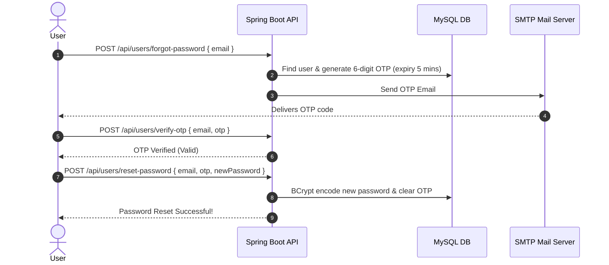

# 🏋️‍♂️ Flex Gym Management System - Backend API

[](https://www.oracle.com/java/)
[](https://spring.io/projects/spring-boot)
[](https://spring.io/projects/spring-security)
[](https://github.com/paulschwarz/spring-dotenv)
[](https://www.mysql.com/)
[](https://maven.apache.org/)
[](LICENSE)

A robust, secure, and production-ready **RESTful API Backend** for the **Flex Gym Management System**, built using **Java 21**, **Spring Boot**, **Spring Data JPA**, **Spring Security**, **Spring Dotenv**, and **MySQL**.

This system centralizes and automates gym business operations, including member registrations, automated membership expiry reminders via background scheduled tasks, role-based access control (RBAC), secure OTP-based password recovery, attendance tracking via QR/ID scanning, store and POS inventory management, customized workout plan assignments, and full facility management (trainers, packages, lockers, equipment).

---

## 📌 Table of Contents
- [✨ Key Features](#-key-features)
- [🛠️ Tech Stack & Dependencies](#️-tech-stack--dependencies)
- [📁 Project Architecture & Structure](#-project-architecture--structure)
- [⚙️ Getting Started & Installation](#️-getting-started--installation)
  - [Prerequisites](#prerequisites)
  - [Environment Configuration (.env)](#environment-configuration-env)
  - [Database Setup](#database-setup)
  - [Running the Application](#running-the-application)
- [🔐 Security & Authentication](#-security--authentication)
  - [Public Endpoints](#public-endpoints-permitted-without-token)
  - [Password Recovery Workflow (OTP)](#password-recovery-workflow-otp)
- [📡 Complete API Endpoints Reference](#-complete-api-endpoints-reference)
  - [1. Authentication & User Management](#1-authentication--user-management)
  - [2. Member Management](#2-member-management)
  - [3. Membership Lifecycle & Approvals](#3-membership-lifecycle--approvals)
  - [4. Attendance Tracking](#4-attendance-tracking)
  - [5. Categories & Store Products](#5-categories--store-products)
  - [6. Orders & POS](#6-orders--pos)
  - [7. Payments & Billing](#7-payments--billing)
  - [8. Workout Plans & Assignments](#8-workout-plans--assignments)
  - [9. Facility & Operations (Packages, Trainers, Lockers, Equipment)](#9-facility--operations)
- [⏰ Automated Scheduler & Email System](#-automated-scheduler--email-system)
- [📄 Standard API Response Format](#-standard-api-response-format)
- [👥 Authors & Acknowledgments](#-authors--acknowledgments)

---

## ✨ Key Features

### 🔐 Authentication, Authorization & Security
- **Stateless JWT Authentication**: Secure bearer tokens generated with custom claims, signed with HMAC-SHA, and validated on every secured request.
- **Role-Based Access Control (RBAC)**: Support for `ROLE_ADMIN`, `ROLE_RECEPTIONIST`, `ROLE_MEMBER`, and `ROLE_TRAINER`.
- **BCrypt Password Hashing**: Passwords stored using 12-round BCrypt encryption.
- **Environment Variable Protection**: Integrated `spring-dotenv` to safeguard database credentials, mail passwords, and JWT secret keys from source control.

### 🔑 Password Reset & OTP Verification *(New Update)*
- **Forgot Password Flow**: Users can request a password reset by providing their registered email address.
- **Secure 6-Digit OTP Generation**: Backend generates a random 6-digit one-time code valid for **5 minutes**.
- **OTP Verification**: Endpoint verifies whether the submitted OTP matches and has not expired.
- **Password Reset**: Securely updates the user password using BCrypt encoding and invalidates the OTP immediately.
- **Automated Email Delivery**: Dispatches OTPs directly to user inboxes using Spring Mail.

### 👤 Member & Membership Management
- Member registration, profile updates, and real-time status synchronization between `Member` and `User` entities (`ACTIVE`, `INACTIVE`, `SUSPENDED`).
- **Membership Request & Approval Workflow**: Members can submit online membership requests; Admins/Receptionists review and approve or reject them.
- Package assignment, membership start/end dates calculation, and renewal tracking.

### ⏰ Scheduled Tasks & Email Notifications
- **Spring `@Scheduled` Cron Job** running automatically every midnight (`0 0 0 * * ?`) to detect expired memberships.
- Automated 3-day advance **Membership Expiration Warning Emails** and **Expired Status Emails**.
- HTML email templates with embedded styling for:
  - Account Credentials Delivery
  - Store Order Receipts with line-item breakdown
  - Membership Expiration Reminders
  - Membership Expired Notices
  - Password Reset OTP Delivery

### 📊 Attendance Tracking
- Fast QR/ID scan endpoint (`/api/attendance/scan`) for check-ins and check-outs.
- Member attendance history and automated monthly summary calculation.

### 🛒 Gym Store, Inventory & POS
- Product inventory categorized by supplement, accessory, gear, etc.
- Low-stock alert threshold query (`/api/products/getLowStockAlerts?minStock=5`).
- Complete POS order placement with automatic stock reduction, itemized bill calculation, and emailed purchase receipts.

### 💳 Payment & Billing Records
- Comprehensive payment ledger supporting `CASH`, `CARD`, and `ONLINE_TRANSFER` across memberships and store orders.
- Dynamic payment status tracking (`PAID`, `PENDING`, `FAILED`, `REFUNDED`).

### 🏋️ Workout Plans & Member Assignment
- Customizable workout plan creation with difficulty levels (`BEGINNER`, `INTERMEDIATE`, `ADVANCED`).
- Personalized member workout plan scheduling and tracking.

### 🏢 Facility Management
- **Trainer Management**: Trainer bio, specialization, and availability status.
- **Package Management**: Gym subscription packages, durations, and pricing.
- **Locker Management**: Locker allocation and state tracking (`AVAILABLE`, `OCCUPIED`, `MAINTENANCE`).
- **Equipment Management**: Inventory tracking and maintenance scheduling (`OPERATIONAL`, `UNDER_MAINTENANCE`, `RETIRED`).

---

## 🛠️ Tech Stack & Dependencies

| Technology | Purpose |
| :--- | :--- |
| **Java 21 (LTS)** | Core programming language |
| **Spring Boot 3.x / 4.x** | Application framework & dependency injection |
| **Spring Data JPA & Hibernate** | Object-relational mapping (ORM) and persistence |
| **Spring Security** | Security filters, authentication, and authorization |
| **JJWT (io.jsonwebtoken 0.12.3)** | JSON Web Token generation & validation |
| **Spring Dotenv (4.0.0)** | Environment variable loading from `.env` files |
| **MySQL 8.0+** | Relational database storage |
| **Spring Mail (JavaMailSender)** | SMTP email dispatching |
| **Lombok** | Boilerplate code reducer (Getters, Setters, Builders) |
| **Apache Maven** | Build automation and dependency management |

---

## 📁 Project Architecture & Structure

The project strictly adheres to a clean, layered architectural pattern:

```text
Flex-Gym-Management-System-Backend/
├── src/
│   ├── main/
│   │   ├── java/lk/ijse/Flex_Gym_Management_System_Backend/
│   │   │   ├── constant/         # API responses & status codes (CommonResponse, Messages)
│   │   │   ├── controller/       # REST API Controllers (14 Controllers)
│   │   │   ├── dto/              # Data Transfer Objects (Requests & Responses)
│   │   │   ├── entity/           # JPA Entities (Hibernate ORM models)
│   │   │   ├── enumeration/      # Enums for statuses, roles, and payment types
│   │   │   ├── exception/        # Global exception handler & custom exceptions
│   │   │   ├── repository/       # Spring Data JPA Repositories
│   │   │   ├── scheduler/        # Background cron jobs (MembershipScheduler)
│   │   │   ├── security/         # SecurityConfig, JwtUtil, JwtAuthenticationFilter
│   │   │   ├── service/          # Business logic interfaces
│   │   │   │   └── impl/         # Service implementations
│   │   │   └── FlexGymManagementSystemBackendApplication.java
│   │   └── resources/
│   │       ├── css/              # External CSS for email templates (style.css)
│   │       ├── html/             # Rich HTML email templates
│   │       └── application.properties # Main application configuration (reads from .env)
│   └── test/                     # Unit and integration test suites
├── .env.example                  # Sample environment configuration template
├── .gitignore                    # Git ignore rules (protects .env and build files)
├── pom.xml                       # Maven build configuration
└── README.md                     # Project documentation
```

---

## ⚙️ Getting Started & Installation

### Prerequisites
Make sure you have the following installed on your machine:
- **JDK 21** or later ([Download OpenJDK / Oracle JDK](https://adoptium.net/))
- **MySQL Server 8.0+** ([Download MySQL](https://dev.mysql.com/downloads/))
- **Apache Maven 3.9+** (or use the included `./mvnw` wrapper)
- **Git**

---

### Environment Configuration (.env)

The application uses **`spring-dotenv`** to securely manage environment variables without exposing sensitive credentials in `application.properties`.

1. Copy `.env.example` to create your own `.env` file in the project root:
   ```bash
   cp .env.example .env
   ```
   *(On Windows PowerShell: `Copy-Item .env.example .env`)*

2. Open `.env` and fill in your actual credentials:
   ```env
   # Database Configuration (MySQL)
   DB_USERNAME=root
   DB_PASSWORD=your_mysql_password

   # SMTP Mail Configuration (Gmail)
   MAIL_USERNAME=your_email@gmail.com
   MAIL_PASSWORD=your_google_app_password

   # JWT Security Secret
   JWT_SECRET=your_super_secret_jwt_key_here_minimum_256_bits
   ```

> ⚠️ **IMPORTANT**: Never commit your `.env` file to version control. It is already added to `.gitignore`.

---

### Database Setup

1. Open your MySQL client (MySQL Workbench, phpMyAdmin, DBeaver, or CLI).
2. Create the database:
   ```sql
   CREATE DATABASE IF NOT EXISTS flex_gym_management_system;
   ```
3. Hibernate will automatically create or update the required database tables on the first run (`spring.jpa.hibernate.ddl-auto=update`).

---

### Running the Application

1. **Clone the repository:**
   ```bash
   git clone https://github.com/chathunga2007/ITS1114-Flex-Gym-Management-System-2nd-Sem-Final-Project-Backend.git
   cd Flex-Gym-Management-System-Backend
   ```

2. **Build and package the project:**
   ```bash
   ./mvnw clean install
   ```

3. **Run the Spring Boot application:**
   - **Using Maven Wrapper:**
     ```bash
     ./mvnw spring-boot:run
     ```
   - **Using JAR file:**
     ```bash
     java -jar target/Flex-Gym-Management-System-Backend-0.0.1-SNAPSHOT.jar
     ```

The backend server starts on port `8080` by default: `http://localhost:8080`.

---

## 🔐 Security & Authentication

All private endpoints require a valid JWT Bearer token in the `Authorization` request header:

```http
Authorization: Bearer <your_jwt_token_here>
```

### Public Endpoints (Permitted without Token)
The following endpoints are public and do not require an `Authorization` header:
- `POST /api/users/login` — User authentication and JWT retrieval
- `POST /api/users/saveUser` — New user registration
- `POST /api/users/forgot-password` — Request password reset OTP
- `POST /api/users/verify-otp` — Verify password reset OTP
- `POST /api/users/reset-password` — Reset password using verified OTP

---

### Password Recovery Workflow (OTP)



#### 1. Forgot Password Request
`POST /api/users/forgot-password`
```json
{
  "email": "member@gmail.com"
}
```

#### 2. Verify OTP
`POST /api/users/verify-otp`
```json
{
  "email": "member@gmail.com",
  "otp": "492810"
}
```

#### 3. Reset Password
`POST /api/users/reset-password`
```json
{
  "email": "member@gmail.com",
  "otp": "492810",
  "newPassword": "MyNewSecurePassword@123"
}
```

---

## 📡 Complete API Endpoints Reference

### 1. Authentication & User Management
**Base Path:** `/api/users`

| Method | Endpoint | Description | Auth Required |
| :--- | :--- | :--- | :---: |
| `POST` | `/login` | Authenticate user & receive JWT Token | ❌ No |
| `POST` | `/saveUser` | Register a new user | ❌ No |
| `POST` | `/forgot-password` | Generate & email 6-digit password reset OTP (valid 5 mins) | ❌ No |
| `POST` | `/verify-otp` | Verify 6-digit OTP code | ❌ No |
| `POST` | `/reset-password` | Reset password using verified OTP | ❌ No |
| `PUT` | `/updateUser` | Update existing user details | ✅ Yes |
| `DELETE` | `/deleteUser/{userId}` | Delete user by ID | ✅ Yes |
| `GET` | `/getAllUsers` | Retrieve all registered users | ✅ Yes |
| `GET` | `/getUser/{userId}` | Get single user profile by ID | ✅ Yes |

---

### 2. Member Management
**Base Path:** `/api/members`

| Method | Endpoint | Description | Auth Required |
| :--- | :--- | :--- | :---: |
| `POST` | `/saveMember` | Register a new gym member | ✅ Yes |
| `PUT` | `/updateMember/{memberId}` | Update member profile and status | ✅ Yes |
| `DELETE` | `/deleteMember/{memberId}` | Deactivate / soft delete member | ✅ Yes |
| `GET` | `/getAllMembers` | Retrieve all active gym members | ✅ Yes |
| `GET` | `/getMember/{memberId}` | Get member profile by ID | ✅ Yes |

---

### 3. Membership Lifecycle & Approvals
**Base Path:** `/api/memberships`

| Method | Endpoint | Description | Auth Required |
| :--- | :--- | :--- | :---: |
| `POST` | `/saveMembership` | Direct create membership (Admin/Receptionist) | ✅ Yes |
| `POST` | `/requestMembership` | Online membership self-request by member | ✅ Yes |
| `PUT` | `/approveMembership/{membershipId}` | Approve pending membership request | ✅ Yes |
| `PUT` | `/rejectMembership/{membershipId}` | Reject pending membership request | ✅ Yes |
| `GET` | `/getAllPendingMemberships` | List all pending membership requests | ✅ Yes |
| `GET` | `/getAllMemberships` | List all active memberships | ✅ Yes |
| `GET` | `/getMembership/{membershipId}` | Retrieve membership details by ID | ✅ Yes |
| `GET` | `/getMembershipsByMember/{memberId}` | List all memberships of a specific member | ✅ Yes |
| `PUT` | `/updateMembership/{membershipId}` | Update membership dates/details | ✅ Yes |
| `DELETE` | `/deleteMembership/{membershipId}` | Delete membership record | ✅ Yes |
| `POST` | `/run-expiry-check` | Manually trigger membership expiration check batch | ✅ Yes |

---

### 4. Attendance Tracking
**Base Path:** `/api/attendance`

| Method | Endpoint | Description | Auth Required |
| :--- | :--- | :--- | :---: |
| `POST` | `/scan` | Fast QR/ID scan to record check-in/check-out | ✅ Yes |
| `GET` | `/getAllLogs` | Retrieve all attendance check-in logs | ✅ Yes |
| `GET` | `/getMemberAttendance/{memberId}` | Retrieve attendance logs for a member | ✅ Yes |
| `GET` | `/getMonthlySummary/{memberId}/{year}/{month}` | Get monthly attendance count summary | ✅ Yes |

---

### 5. Categories & Store Products
**Base Paths:** `/api/categories` & `/api/products`

#### Categories (`/api/categories`)
| Method | Endpoint | Description | Auth Required |
| :--- | :--- | :--- | :---: |
| `POST` | `/saveCategory` | Create a new product category | ✅ Yes |
| `PUT` | `/updateCategory` | Update category details | ✅ Yes |
| `GET` | `/getCategory/{categoryId}` | Get category by ID | ✅ Yes |
| `GET` | `/getAllCategories` | List all active product categories | ✅ Yes |
| `DELETE` | `/deleteCategory/{categoryId}` | Delete product category | ✅ Yes |

#### Products (`/api/products`)
| Method | Endpoint | Description | Auth Required |
| :--- | :--- | :--- | :---: |
| `POST` | `/saveProduct` | Add new product to inventory | ✅ Yes |
| `PUT` | `/updateProduct` | Update product details & stock | ✅ Yes |
| `GET` | `/getProduct/{productId}` | Get product details by ID | ✅ Yes |
| `GET` | `/getAllProducts` | List all active products | ✅ Yes |
| `GET` | `/getProductsByCategory/{categoryId}` | Filter products by category | ✅ Yes |
| `GET` | `/getLowStockAlerts?minStock=5` | Check low-stock inventory alerts | ✅ Yes |
| `DELETE` | `/deleteProduct/{productId}` | Delete product from inventory | ✅ Yes |

---

### 6. Orders & POS
**Base Path:** `/api/orders`

| Method | Endpoint | Description | Auth Required |
| :--- | :--- | :--- | :---: |
| `POST` | `/placeOrder` | Place new order & auto-send HTML receipt email | ✅ Yes |
| `GET` | `/getOrder/{orderId}` | Get order details with itemized list | ✅ Yes |
| `GET` | `/getAllOrders` | Retrieve all store orders | ✅ Yes |
| `GET` | `/getMemberOrders/{memberId}` | Get all orders placed by a member | ✅ Yes |
| `PUT` | `/updateOrderStatus/{orderId}` | Update order status and payment status | ✅ Yes |

---

### 7. Payments & Billing
**Base Path:** `/api/payments`

| Method | Endpoint | Description | Auth Required |
| :--- | :--- | :--- | :---: |
| `POST` | `/savePayment` | Record new payment transaction | ✅ Yes |
| `PUT` | `/updatePaymentStatus/{id}?paymentStatus=PAID` | Update payment status | ✅ Yes |
| `GET` | `/getPayment/{id}` | Get payment by ID | ✅ Yes |
| `GET` | `/getAllPayments` | List all payment transactions | ✅ Yes |
| `GET` | `/getPaymentsByMember/{memberId}` | List payment history of a member | ✅ Yes |
| `DELETE` | `/deletePayment/{id}` | Delete payment transaction | ✅ Yes |

---

### 8. Workout Plans & Assignments
**Base Paths:** `/api/workout-plans` & `/api/member-workout-plans`

#### Workout Plan Templates (`/api/workout-plans`)
| Method | Endpoint | Description | Auth Required |
| :--- | :--- | :--- | :---: |
| `POST` | `/saveWorkoutPlan` | Create workout plan template | ✅ Yes |
| `PUT` | `/updateWorkoutPlan` | Update workout plan template | ✅ Yes |
| `GET` | `/getWorkoutPlan/{planId}` | Get workout plan by ID | ✅ Yes |
| `GET` | `/getAllWorkoutPlans` | List all workout plan templates | ✅ Yes |
| `DELETE` | `/deleteWorkoutPlan/{planId}` | Delete workout plan template | ✅ Yes |

#### Member Workout Plan Assignments (`/api/member-workout-plans`)
| Method | Endpoint | Description | Auth Required |
| :--- | :--- | :--- | :---: |
| `POST` | `/assignPlan` | Assign workout plan to member | ✅ Yes |
| `PUT` | `/updatePlan` | Update member workout assignment | ✅ Yes |
| `GET` | `/getPlan/{id}` | Get member workout plan assignment by ID | ✅ Yes |
| `GET` | `/getAllPlans` | List all member workout plan assignments | ✅ Yes |
| `DELETE` | `/deletePlan/{id}` | Remove workout assignment | ✅ Yes |

---

### 9. Facility & Operations
**Base Paths:** `/api/packages`, `/api/trainers`, `/api/lockers`, `/api/equipments`

#### Membership Packages (`/api/packages`)
| Method | Endpoint | Description | Auth Required |
| :--- | :--- | :--- | :---: |
| `POST` | `/savePackage` | Create membership package plan | ✅ Yes |
| `PUT` | `/updatePackage` | Update package plan details | ✅ Yes |
| `GET` | `/getPackage/{packageId}` | Get package by ID | ✅ Yes |
| `GET` | `/getAllPackages` | List all available packages | ✅ Yes |
| `DELETE` | `/deletePackage/{packageId}` | Delete membership package | ✅ Yes |

#### Trainers (`/api/trainers`)
| Method | Endpoint | Description | Auth Required |
| :--- | :--- | :--- | :---: |
| `POST` | `/saveTrainer` | Register trainer profile | ✅ Yes |
| `PUT` | `/updateTrainer` | Update trainer details | ✅ Yes |
| `GET` | `/getTrainer/{trainerId}` | Get trainer details by ID | ✅ Yes |
| `GET` | `/getAllTrainers` | List all trainers | ✅ Yes |
| `DELETE` | `/deleteTrainer/{trainerId}` | Delete trainer record | ✅ Yes |

#### Lockers (`/api/lockers`)
| Method | Endpoint | Description | Auth Required |
| :--- | :--- | :--- | :---: |
| `POST` | `/saveLocker` | Add new locker | ✅ Yes |
| `PUT` | `/updateLocker` | Update locker details/status | ✅ Yes |
| `GET` | `/getLocker/{lockerId}` | Get locker details by ID | ✅ Yes |
| `GET` | `/getAllLockers` | List all lockers | ✅ Yes |
| `DELETE` | `/deleteLocker/{lockerId}` | Delete locker | ✅ Yes |

#### Equipment (`/api/equipments`)
| Method | Endpoint | Description | Auth Required |
| :--- | :--- | :--- | :---: |
| `POST` | `/saveEquipment` | Add gym machinery/equipment | ✅ Yes |
| `PUT` | `/updateEquipment` | Update equipment status/details | ✅ Yes |
| `GET` | `/getEquipment/{equipmentId}` | Get equipment by ID | ✅ Yes |
| `GET` | `/getAllEquipments` | List all gym equipment | ✅ Yes |
| `DELETE` | `/deleteEquipment/{equipmentId}` | Delete equipment record | ✅ Yes |

---

## ⏰ Automated Scheduler & Email System

### 1. Membership Expiry Automation
The system runs `MembershipScheduler.java` automatically every day at midnight (`0 0 0 * * ?`):
- **3 Days Prior:** Sends an automated reminder email advising the member to renew.
- **On Expiry Date:** Automatically updates membership status to `EXPIRED` and sends an expiration notification email.

### 2. Email Notifications
Dispatched using Spring Mail (`JavaMailSender`) with custom styling and templates located in `src/main/resources/html/`:
- **Password Reset OTP Email**: Sends the 6-digit verification code for forgotten passwords.
- **Credentials Delivery Email** (`credentials-email.html`): Welcome email with login credentials for new accounts.
- **Store Order Receipt** (`order-receipt.html`): POS store purchase receipt with itemized summary table.
- **Membership Reminder Email** (`membership-reminder-email.html`): Expiry warning with remaining days count.
- **Membership Expired Email** (`membership-expired-email.html`): Final expiration notice and renewal instructions.

---

## 📄 Standard API Response Format

All API endpoints return responses encapsulated within the `CommonResponse` structure:

```json
{
  "code": 200,
  "data": {
    "userId": 1,
    "email": "user@flexgym.com",
    "userRole": "ROLE_ADMIN"
  },
  "message": "Operation Successful"
}
```

### Standard Status Codes:
- `200` (`OPERATION_SUCCESS`): Action completed successfully.
- `400`: Bad Request / Validation error / Expired OTP.
- `401`: Unauthorized / Invalid OTP.
- `404`: Resource not found (e.g. User or Member not found).
- `500`: Internal application error handled gracefully by `AppExceptionHandler`.

---

## 👥 Authors & Acknowledgments

- **Developer:** [Chathunga Bimsara](https://github.com/chathunga2007)
- **Institution / Program:** IJSE (Institute of Software Engineering) - 2nd Semester Final Project
- **Project:** Flex Gym Management System

---

<p align="center">Made with ❤️ for modern gym and fitness center management.</p>
