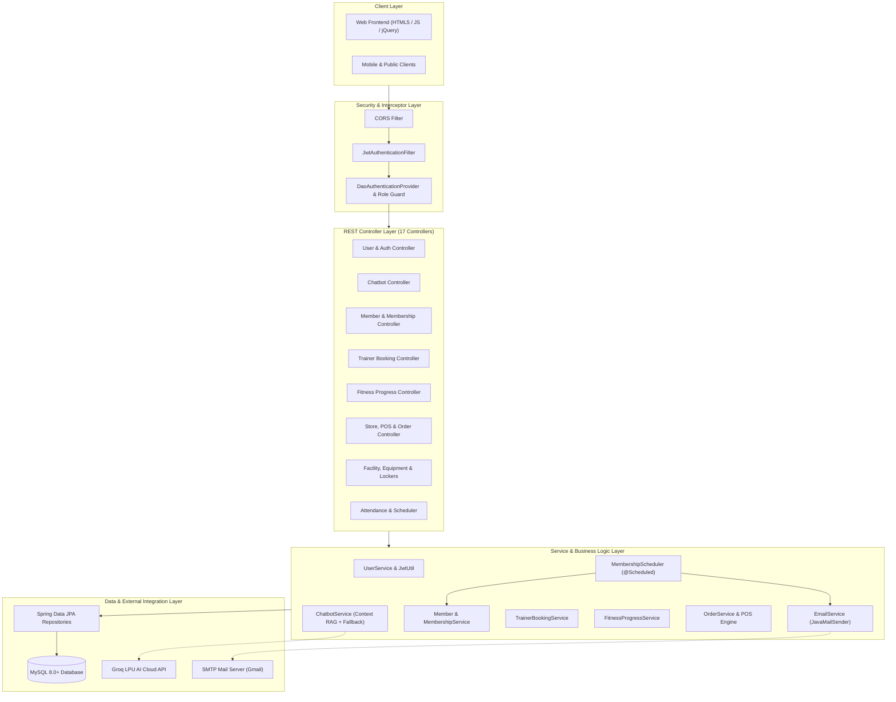
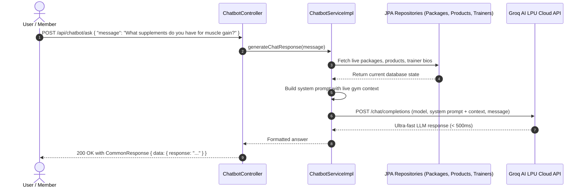
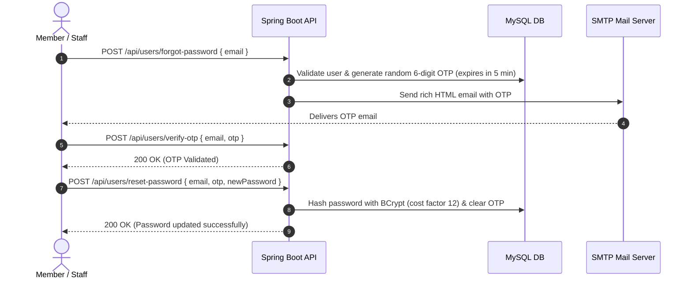
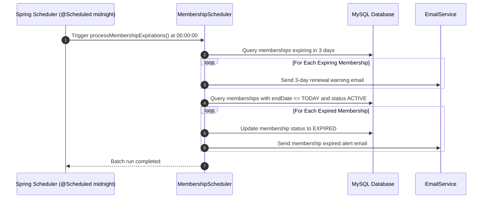

<p align="center">
  <a href="https://github.com/chathunga2007/ITS1114-Flex-Gym-Management-System-2nd-Sem-Final-Project-Backend">
    
  </a>
</p>

<h1 align="center">🏋️‍♂️ Flex Gym Management System — Enterprise REST API</h1>

<p align="center">
  <strong>High-Performance, Cloud-Native Fitness Center Management Engine</strong><br>
  Built with <strong>Java 21 LTS</strong>, <strong>Spring Boot 3.x</strong>, <strong>Spring Security (JWT + RBAC)</strong>, <strong>Groq AI LPU</strong>, <strong>MySQL</strong>, and <strong>Docker</strong>.
</p>

<p align="center">
  <a href="https://adoptium.net/"></a>
  <a href="https://spring.io/projects/spring-boot"></a>
  <a href="https://spring.io/projects/spring-security"></a>
  <a href="https://groq.com/"></a>
  <a href="https://www.mysql.com/"></a>
  <a href="https://www.docker.com/"></a>
  <a href="LICENSE"></a>
</p>

---

## 📌 Executive Summary

The **Flex Gym Management System Backend** is an enterprise-grade RESTful API designed to automate and unify every tier of fitness club operations. From member lifecycle management, QR attendance tracking, point-of-sale (POS) store management, and trainer scheduling, to **Groq-accelerated AI fitness consultations** and automated email workflows, this system provides a secure, decoupled, and cloud-deployable backend architecture.

---

## 📑 Table of Contents
1. [🌟 Recent Advancements & New Features](#-recent-advancements--new-features)
2. [🏛️ Architectural Design & Workflows](#️-architectural-design--workflows)
3. [🔐 Role-Based Access Control (RBAC) Matrix](#-role-based-access-control-rbac-matrix)
4. [🛠️ Tech Stack & Key Libraries](#️-tech-stack--key-libraries)
5. [📁 Project Architecture & Directory Layout](#-project-architecture--directory-layout)
6. [⚙️ Getting Started & Installation](#️-getting-started--installation)
   - [Prerequisites](#prerequisites)
   - [Environment Configuration (.env)](#environment-configuration-env)
   - [Database Setup](#database-setup)
   - [Running the Application](#running-the-application)
7. [🐳 Docker & Cloud Deployment (Render / Cloud DB)](#-docker--cloud-deployment-render--cloud-db)
8. [📡 Complete REST API Reference (17 Modules)](#-complete-rest-api-reference-17-modules)
   - [1. Authentication & Security](#1-authentication--security)
   - [2. FlexBot AI Fitness Assistant (Groq LPU)](#2-flexbot-ai-fitness-assistant-groq-lpu)
   - [3. Member Management](#3-member-management)
   - [4. Membership Lifecycle & Approvals](#4-membership-lifecycle--approvals)
   - [5. Personal Trainer Booking & Schedules](#5-personal-trainer-booking--schedules)
   - [6. Fitness Progress & Body Stats Tracker](#6-fitness-progress--body-stats-tracker)
   - [7. Attendance Tracking](#7-attendance-tracking)
   - [8. Store Categories & Products Inventory](#8-store-categories--products-inventory)
   - [9. Store Orders, POS & Parcel Tracking](#9-store-orders-pos--parcel-tracking)
   - [10. Payments & Billing Records](#10-payments--billing-records)
   - [11. Workout Plans & Assignments](#11-workout-plans--assignments)
   - [12. Facility & Operations (Packages, Trainers, Lockers, Equipment)](#12-facility--operations)
9. [⏰ Automated Scheduler & HTML Email Engine](#-automated-scheduler--html-email-engine)
10. [🧪 Sample API Payloads & cURL Requests](#-sample-api-payloads--curl-requests)
11. [📄 Unified API Response Format](#-unified-api-response-format)
12. [👨‍💻 Developer & Project Credits](#-developer--project-credits)

---

## 🌟 Recent Advancements & New Features

### 🤖 1. FlexBot — AI Fitness & Gym Assistant (Groq LPU Powered)
- **High-Velocity Inference:** Powered by Groq's Language Processing Units (LPU) with sub-second response times.
- **Dynamic Context Injection (RAG):** Automatically aggregates live database state (active gym packages, store supplement inventory, trainer specialties) directly into the AI system prompt.
- **Resilient Model Failover:** Automatically queries active Groq models and switches seamlessly (`llama-3.1-8b-instant`, `llama-3.3-70b-versatile`, `mixtral-8x7b-32768`) if a candidate model is deprecated.
- **Public Consultation Endpoint:** Available to guests and members alike at `POST /api/chatbot/ask`.

### 📅 2. Personal Trainer Booking & Session Management
- **Self-Service Booking:** Members can schedule 1-on-1 sessions with specialized personal trainers (`POST /api/bookings/create`).
- **Trainer Dashboard & Today's Schedule:** Trainers can retrieve their daily agenda via `GET /api/bookings/trainer/{trainerId}/today`.
- **Status Lifecycle & Feedback:** Integrated status transitions (`PENDING` ➔ `CONFIRMED` ➔ `COMPLETED` ➔ `CANCELLED`) with custom trainer feedback notes.

### 📈 3. Fitness Progress & Body Metrics Tracker
- **Comprehensive Body Tracking:** Logs weight (kg), body fat (%), muscle mass (kg), chest, waist, and arms measurements.
- **Automated Health Analytics:** Dynamically calculates BMI, BMI categories (Underweight, Normal, Overweight, Obese), weight change delta, and milestone achievement badges.
- **Historical Progress Timeline:** Full progression history and latest metrics query (`/api/progress/member/{memberId}/latest`).

### 📦 4. Smart Order Tracking & Courier Logistics
- **Public Parcel Tracking:** Real-time order lookup by tracking number (`GET /api/orders/track/{trackingNumber}`) without requiring authentication.
- **Fulfillment Management:** Admin/Receptionist order status updates with courier names and external tracking identifiers.

### 🐳 5. Multi-Stage Docker & Cloud Hosting Compatibility
- **Minimalist Alpine Footprint:** Multi-stage `Dockerfile` (Maven 3.9 Temurin build ➔ Eclipse Temurin 21 JRE Alpine runner) resulting in an ultra-compact production container.
- **Dynamic Port & Cloud Binding:** Native support for dynamic container ports (`ENV PORT=7860` / `server.port=${PORT}`) compatible with Render, Railway, AWS ECS, and Hugging Face Spaces.
- **Cloud Database Support:** Ready for cloud MySQL instances (Aiven, TiDB Serverless, Railway, AWS RDS) with customizable SSL modes (`DB_URL`).

### 🔐 6. Fine-Grained Security & Custom Exception Interceptors
- **Strict Role-Based Authorization:** Endpoints locked down per business role (`ROLE_ADMIN`, `ROLE_RECEPTIONIST`, `ROLE_TRAINER`, `ROLE_MEMBER`).
- **RESTful Error Interception:** Explicit JSON `401 Unauthorized` and `403 Forbidden` responses returned directly by `SecurityConfig` instead of generic container error pages.

---

## 🏛️ Architectural Design & Workflows

### System Architecture Diagram



---

### Key Workflow Sequences

#### 1. Context-Aware AI Chatbot (Groq LPU)


#### 2. Secure OTP Password Recovery Workflow


#### 3. Midnight Membership Expiration Cron Engine


---

## 🔐 Role-Based Access Control (RBAC) Matrix

The system implements strict URL and HTTP-method security constraints:

| Module / Scope | Endpoints | Public | `ROLE_MEMBER` | `ROLE_TRAINER` | `ROLE_RECEPTIONIST` | `ROLE_ADMIN` |
| :--- | :--- | :---: | :---: | :---: | :---: | :---: |
| **Authentication** | `/api/users/login`, `/saveUser`, `/forgot-password`, `/verify-otp`, `/reset-password` | ✅ | ✅ | ✅ | ✅ | ✅ |
| **User Administration** | `/api/users/getAllUsers`, `/deleteUser/**` | ❌ | ❌ | ❌ | ❌ | ✅ |
| **Profile Settings** | `/api/users/getUser/**`, `/updateUser` | ❌ | ✅ | ✅ | ✅ | ✅ |
| **AI Assistant** | `/api/chatbot/**` | ✅ | ✅ | ✅ | ✅ | ✅ |
| **Public Catalog** | `GET /api/products/**`, `/categories/**`, `/packages/**`, `/trainers/**` | ✅ | ✅ | ✅ | ✅ | ✅ |
| **Order Tracking** | `GET /api/orders/track/**` | ✅ | ✅ | ✅ | ✅ | ✅ |
| **Catalog Management** | `POST/PUT/DELETE /api/packages/**`, `/products/**`, `/categories/**`, `/trainers/**` | ❌ | ❌ | ❌ | ❌ | ✅ |
| **Equipment & Assets** | `/api/equipments/**` | ❌ | ❌ | ❌ | ❌ | ✅ |
| **Membership Approvals** | `/api/memberships/approveMembership/**`, `/rejectMembership/**`, `/getAllPendingMemberships` | ❌ | ❌ | ❌ | ✅ | ✅ |
| **Front Desk POS & Orders**| `/api/orders/getAllOrders`, `/updateOrderStatus/**`, `/payments/getAllPayments` | ❌ | ❌ | ❌ | ✅ | ✅ |
| **Attendance Scanning** | `POST /api/attendance/scan` | ❌ | ❌ | ❌ | ✅ | ✅ |
| **Attendance Reports** | `GET /api/attendance/getAllLogs` | ❌ | ❌ | ✅ | ✅ | ✅ |
| **Workout Design** | `/api/workout-plans/saveWorkoutPlan`, `/updateWorkoutPlan` | ❌ | ❌ | ✅ | ❌ | ✅ |
| **Trainer Bookings** | `POST /api/bookings/create`, `GET /member/**`, `PUT /update-status/**` | ❌ | ✅ | ✅ | ✅ | ✅ |
| **Trainer Today Agenda** | `GET /api/bookings/trainer/**` | ❌ | ❌ | ✅ | ❌ | ✅ |
| **All Bookings Overview**| `GET /api/bookings/all` | ❌ | ❌ | ❌ | ✅ | ✅ |
| **Fitness Progress** | `/api/progress/**` | ❌ | ✅ | ✅ | ✅ | ✅ |
| **Order Placement (POS)**| `POST /api/orders/placeOrder` | ❌ | ✅ | ✅ | ✅ | ✅ |

---

## 🛠️ Tech Stack & Key Libraries

| Component | Technology | Version | Description |
| :--- | :--- | :--- | :--- |
| **Platform** | **Java** | `21 (LTS)` | Virtual threads & modern language features |
| **Framework** | **Spring Boot** | `3.4.x / 4.x` | Enterprise application architecture |
| **Security** | **Spring Security** | `6.x` | Stateless filter chains, BCrypt & RBAC |
| **Tokens** | **JJWT (io.jsonwebtoken)** | `0.12.3` | Cryptographically signed JSON Web Tokens |
| **AI Engine** | **Groq Cloud API** | `OpenAI Compat` | Sub-second LPU inference (`llama-3.1-8b-instant`) |
| **Database** | **MySQL Server** | `8.0+` | Relational storage & ACID transactions |
| **Persistence**| **Spring Data JPA** | Hibernate ORM | Declarative data repositories & query derivation |
| **Config Guard**| **Spring Dotenv** | `4.0.0` | 12-Factor App `.env` credential isolation |
| **Mailing** | **Spring Mail (JavaMailSender)**| SMTP | Rich HTML email dispatching |
| **Container** | **Docker** | Multi-Stage | Minimal Eclipse Temurin 21 Alpine image |
| **Build Tool** | **Apache Maven** | `3.9+` | Dependency lifecycle & automated builds |
| **Utilities** | **Project Lombok** | Latest | Automated getters, setters, builders, loggers |

---

## 📁 Project Architecture & Directory Layout

```text
Flex-Gym-Management-System-Backend/
├── assets/
│   └── flex-gym-logo.png                # Official Flex Gym branding asset
├── src/
│   ├── main/
│   │   ├── java/lk/ijse/Flex_Gym_Management_System_Backend/
│   │   │   ├── constant/                # CommonResponse & HTTP Response constants
│   │   │   ├── controller/              # 17 REST API Controllers
│   │   │   │   ├── AttendanceController.java
│   │   │   │   ├── CategoryController.java
│   │   │   │   ├── ChatbotController.java            # AI Assistant endpoint
│   │   │   │   ├── EquipmentController.java
│   │   │   │   ├── FitnessProgressController.java    # Body stats & BMI tracking
│   │   │   │   ├── LockerController.java
│   │   │   │   ├── MemberController.java
│   │   │   │   ├── MemberWorkoutPlanController.java
│   │   │   │   ├── MembershipController.java
│   │   │   │   ├── OrderController.java              # Orders & parcel tracking
│   │   │   │   ├── PackageController.java
│   │   │   │   ├── PaymentController.java
│   │   │   │   ├── ProductController.java
│   │   │   │   ├── TrainerBookingController.java     # Personal trainer sessions
│   │   │   │   ├── TrainerController.java
│   │   │   │   ├── UserController.java               # Auth & OTP password reset
│   │   │   │   └── WorkoutPlanController.java
│   │   │   ├── dto/                     # Data Transfer Objects (Payloads & Responses)
│   │   │   ├── entity/                  # JPA Entities (Hibernate database models)
│   │   │   ├── enumeration/             # Type-safe Enums (Roles, Statuses, Payment types)
│   │   │   ├── exception/               # Global AppExceptionHandler & custom exceptions
│   │   │   ├── repository/              # Spring Data JPA Repository interfaces
│   │   │   ├── scheduler/               # MembershipScheduler (Midnight Cron job)
│   │   │   ├── security/                # SecurityConfig, JwtUtil, JwtAuthenticationFilter
│   │   │   └── service/                 # Business logic interfaces
│   │   │       └── impl/                # Robust service implementations (Groq AI, etc.)
│   │   └── resources/
│   │       ├── css/style.css            # Styles for rich HTML email notifications
│   │       ├── html/                    # 5 Rich HTML Email Templates
│   │       │   ├── credentials-email.html
│   │       │   ├── membership-expired-email.html
│   │       │   ├── membership-reminder-email.html
│   │       │   ├── order-receipt.html
│   │       │   └── password-reset-otp.html
│   │       └── application.properties   # Dynamic configuration powered by .env
│   └── test/                            # Spring Boot test suites
├── .dockerignore                         # Docker build optimization exclusions
├── .env.example                         # Environment variable template
├── .gitignore                           # Git ignore rules (protects credentials & binaries)
├── Dockerfile                           # Production multi-stage Alpine Dockerfile
├── pom.xml                              # Maven project descriptors & dependencies
└── README.md                            # Comprehensive project documentation
```

---

## ⚙️ Getting Started & Installation

### Prerequisites
- **JDK 21 (LTS)** or higher ([Adoptium Temurin](https://adoptium.net/))
- **MySQL Server 8.0+** ([MySQL Community Server](https://dev.mysql.com/downloads/mysql/))
- **Apache Maven 3.9+** (or use the packaged `./mvnw` / `mvnw.cmd`)
- **Git**

---

### Environment Configuration (.env)

The project leverages `spring-dotenv` to safeguard sensitive secrets.

1. **Create your `.env` file** from the provided template:
   ```bash
   cp .env.example .env
   ```
   *(On Windows PowerShell: `Copy-Item .env.example .env`)*

2. **Configure your `.env` values:**
   ```env
   # ==========================================
   # DATABASE CONFIGURATION
   # ==========================================
   # Local MySQL:
   DB_URL=jdbc:mysql://localhost:3306/flex_gym_management_system?createDatabaseIfNotExist=true&useSSL=false&allowPublicKeyRetrieval=true
   DB_USERNAME=root
   DB_PASSWORD=your_mysql_password

   # Or Cloud Database (Aiven / TiDB / Railway):
   # DB_URL=jdbc:mysql://your-cloud-host:3306/defaultdb?sslMode=VERIFY_IDENTITY

   # ==========================================
   # SPRING MAIL (SMTP - Gmail)
   # ==========================================
   # Use a 16-character Google App Password (not your primary Gmail password)
   MAIL_USERNAME=your_email@gmail.com
   MAIL_PASSWORD=your_16_char_google_app_password

   # ==========================================
   # JWT SECURITY CONFIGURATION
   # ==========================================
   # Minimum 256-bit secure key
   JWT_SECRET=your_super_secret_jwt_key_at_least_256_bits_long_random_string

   # ==========================================
   # GROQ AI ASSISTANT (100% Free at console.groq.com)
   # ==========================================
   GROQ_API_KEY=gsk_your_groq_api_key_here
   GROQ_MODEL=llama-3.1-8b-instant
   GROQ_API_URL=https://api.groq.com/openai/v1/chat/completions
   ```

---

### Database Setup

1. Log into your MySQL console or client (DataGrip, Workbench, CLI):
   ```sql
   CREATE DATABASE IF NOT EXISTS flex_gym_management_system;
   ```
2. Hibernate's `ddl-auto=update` will generate all schema tables, foreign key constraints, and relational indices automatically upon first launch.

---

### Running the Application

```bash
# 1. Clone repository
git clone https://github.com/chathunga2007/ITS1114-Flex-Gym-Management-System-2nd-Sem-Final-Project-Backend.git
cd Flex-Gym-Management-System-Backend

# 2. Build project
./mvnw clean install -DskipTests

# 3. Launch Spring Boot Server
./mvnw spring-boot:run
```

*(On Windows PowerShell, run `.\mvnw.cmd spring-boot:run`)*

The server will start listening at: **`http://localhost:8080`**.

---

## 🐳 Docker & Cloud Deployment (Render / Cloud DB)

### 1. Build and Run with Docker Locally

```bash
# Build production Docker image
docker build -t flex-gym-backend .

# Run container passing .env variables
docker run -d \
  -p 8080:7860 \
  --env-file .env \
  -e PORT=7860 \
  --name flex-gym-backend-container \
  flex-gym-backend
```

### 2. Deploying on Render (Web Service)
1. Fork or push this repository to GitHub.
2. Create a new **Web Service** on [Render](https://render.com/).
3. Choose **Docker Runtime**.
4. In the **Environment Variables** tab on Render, add:
   - `DB_URL`: Your cloud MySQL JDBC URL (e.g., Aiven or TiDB)
   - `DB_USERNAME`: Database username
   - `DB_PASSWORD`: Database password
   - `JWT_SECRET`: 256-bit random security string
   - `MAIL_USERNAME`: Gmail address
   - `MAIL_PASSWORD`: Google App Password
   - `GROQ_API_KEY`: Groq API key (`gsk_...`)
   - `GROQ_MODEL`: `llama-3.1-8b-instant`
5. Render automatically builds the multi-stage Docker container and exposes the API.

---

## 📡 Complete REST API Reference (17 Modules)

### 1. Authentication & Security
**Base Path:** `/api/users`

| Method | Endpoint | Description | Permission |
| :--- | :--- | :--- | :---: |
| `POST` | `/login` | Authenticate user & receive JWT Bearer token | `PUBLIC` |
| `POST` | `/saveUser` | Register a new user | `PUBLIC` |
| `POST` | `/forgot-password` | Send 6-digit OTP code to registered email | `PUBLIC` |
| `POST` | `/verify-otp` | Validate submitted 6-digit OTP | `PUBLIC` |
| `POST` | `/reset-password` | Set new password using verified OTP | `PUBLIC` |
| `GET` | `/getUser/{userId}` | Retrieve user profile details | `AUTHENTICATED` |
| `PUT` | `/updateUser` | Update user profile information | `AUTHENTICATED` |
| `GET` | `/getAllUsers` | Retrieve all registered users | `ROLE_ADMIN` |
| `DELETE` | `/deleteUser/{userId}` | Delete user account by ID | `ROLE_ADMIN` |

---

### 2. FlexBot AI Fitness Assistant (Groq LPU)
**Base Path:** `/api/chatbot`

| Method | Endpoint | Description | Permission |
| :--- | :--- | :--- | :---: |
| `POST` | `/ask` | Ask FlexBot fitness, package, product or routine questions | `PUBLIC` |

---

### 3. Member Management
**Base Path:** `/api/members`

| Method | Endpoint | Description | Permission |
| :--- | :--- | :--- | :---: |
| `POST` | `/saveMember` | Register new member profile | `ADMIN`, `RECEPTIONIST` |
| `PUT` | `/updateMember/{memberId}` | Update member profile | `AUTHENTICATED` |
| `GET` | `/getMember/{memberId}` | Get member profile by ID | `AUTHENTICATED` |
| `GET` | `/getAllMembers` | List all registered members | `ADMIN`, `RECEPTIONIST`, `TRAINER` |
| `DELETE` | `/deleteMember/{memberId}` | Soft delete/deactivate member | `ROLE_ADMIN` |

---

### 4. Membership Lifecycle & Approvals
**Base Path:** `/api/memberships`

| Method | Endpoint | Description | Permission |
| :--- | :--- | :--- | :---: |
| `POST` | `/requestMembership` | Member online self-request for subscription | `AUTHENTICATED` |
| `POST` | `/saveMembership` | Direct create membership | `ADMIN`, `RECEPTIONIST` |
| `PUT` | `/approveMembership/{id}` | Approve pending membership request | `ADMIN`, `RECEPTIONIST` |
| `PUT` | `/rejectMembership/{id}` | Reject pending membership request | `ADMIN`, `RECEPTIONIST` |
| `GET` | `/getAllPendingMemberships` | Retrieve list of pending memberships | `ADMIN`, `RECEPTIONIST` |
| `GET` | `/getAllMemberships` | List all active memberships | `ADMIN`, `RECEPTIONIST` |
| `GET` | `/getMembership/{id}` | Retrieve membership by ID | `ADMIN`, `RECEPTIONIST` |
| `GET` | `/getMembershipsByMember/{memberId}` | Get all memberships of specific member | `AUTHENTICATED` |
| `PUT` | `/updateMembership/{id}` | Update membership validity dates | `ADMIN`, `RECEPTIONIST` |
| `DELETE` | `/deleteMembership/{id}` | Remove membership record | `ROLE_ADMIN` |
| `POST` | `/run-expiry-check` | Manually invoke midnight expiry check batch | `ADMIN`, `RECEPTIONIST` |

---

### 5. Personal Trainer Booking & Schedules
**Base Path:** `/api/bookings`

| Method | Endpoint | Description | Permission |
| :--- | :--- | :--- | :---: |
| `POST` | `/create` | Book 1-on-1 personal training session | `AUTHENTICATED` |
| `GET` | `/member/{memberId}` | Get booking history of member | `AUTHENTICATED` |
| `GET` | `/trainer/{trainerId}` | Get all bookings of a trainer | `ADMIN`, `TRAINER` |
| `GET` | `/trainer/{trainerId}/today` | Get today's scheduled training sessions | `ADMIN`, `TRAINER` |
| `GET` | `/all` | Retrieve all gym personal training bookings | `ADMIN`, `RECEPTIONIST` |
| `PUT` | `/update-status/{bookingId}` | Update status (`CONFIRMED`, `COMPLETED`, `CANCELLED`) & feedback | `AUTHENTICATED` |

---

### 6. Fitness Progress & Body Stats Tracker
**Base Path:** `/api/progress`

| Method | Endpoint | Description | Permission |
| :--- | :--- | :--- | :---: |
| `POST` | `/log` | Record body stats (weight, body fat %, muscle mass, measurements) | `AUTHENTICATED` |
| `GET` | `/member/{memberId}` | Retrieve comprehensive fitness progress history | `AUTHENTICATED` |
| `GET` | `/member/{memberId}/latest` | Retrieve latest recorded fitness stats & BMI | `AUTHENTICATED` |
| `DELETE` | `/{progressId}` | Delete a specific progress record entry | `AUTHENTICATED` |

---

### 7. Attendance Tracking
**Base Path:** `/api/attendance`

| Method | Endpoint | Description | Permission |
| :--- | :--- | :--- | :---: |
| `POST` | `/scan` | Fast QR/Barcode scan check-in / check-out | `ADMIN`, `RECEPTIONIST` |
| `GET` | `/getAllLogs` | Retrieve all gym entry/exit logs | `ADMIN`, `RECEPTIONIST`, `TRAINER` |
| `GET` | `/getMemberAttendance/{memberId}` | Retrieve attendance logs for a member | `AUTHENTICATED` |
| `GET` | `/getMonthlySummary/{memberId}/{year}/{month}` | Monthly attendance breakdown | `AUTHENTICATED` |

---

### 8. Store Categories & Products Inventory
**Base Paths:** `/api/categories` & `/api/products`

| Method | Endpoint | Description | Permission |
| :--- | :--- | :--- | :---: |
| `GET` | `/api/categories/**` | List categories (supplements, gear, apparel) | `PUBLIC` |
| `POST` | `/api/categories/saveCategory` | Create product category | `ROLE_ADMIN` |
| `PUT` | `/api/categories/updateCategory` | Update category details | `ROLE_ADMIN` |
| `DELETE` | `/api/categories/deleteCategory/{id}` | Delete category | `ROLE_ADMIN` |
| `GET` | `/api/products/**` | Browse product catalog & filters | `PUBLIC` |
| `GET` | `/api/products/getLowStockAlerts?minStock=5` | Query low-stock alerts | `ADMIN`, `RECEPTIONIST` |
| `POST` | `/api/products/saveProduct` | Add new product & initial stock | `ROLE_ADMIN` |
| `PUT` | `/api/products/updateProduct` | Update product details & price | `ROLE_ADMIN` |
| `DELETE` | `/api/products/deleteProduct/{id}` | Delete product | `ROLE_ADMIN` |

---

### 9. Store Orders, POS & Parcel Tracking
**Base Path:** `/api/orders`

| Method | Endpoint | Description | Permission |
| :--- | :--- | :--- | :---: |
| `GET` | `/track/{trackingNumber}` | Public lookup order status & courier details | `PUBLIC` |
| `POST` | `/placeOrder` | Place POS order, reduce stock & auto-email receipt | `AUTHENTICATED` |
| `GET` | `/getOrder/{orderId}` | Get order details with itemized list | `AUTHENTICATED` |
| `GET` | `/getMemberOrders/{memberId}` | Get order history of member | `AUTHENTICATED` |
| `GET` | `/getAllOrders` | Retrieve all store orders | `ADMIN`, `RECEPTIONIST` |
| `PUT` | `/updateOrderStatus/{orderId}` | Update order status, courier & tracking number | `ADMIN`, `RECEPTIONIST` |

---

### 10. Payments & Billing Records
**Base Path:** `/api/payments`

| Method | Endpoint | Description | Permission |
| :--- | :--- | :--- | :---: |
| `POST` | `/savePayment` | Record new transaction (`CASH`, `CARD`, `ONLINE_TRANSFER`)| `ADMIN`, `RECEPTIONIST` |
| `PUT` | `/updatePaymentStatus/{id}?paymentStatus=PAID` | Update payment state | `ADMIN`, `RECEPTIONIST` |
| `GET` | `/getPayment/{id}` | Retrieve payment invoice by ID | `ADMIN`, `RECEPTIONIST` |
| `GET` | `/getAllPayments` | View complete payment ledger | `ADMIN`, `RECEPTIONIST` |
| `GET` | `/getPaymentsByMember/{memberId}` | View member payment history | `AUTHENTICATED` |
| `DELETE` | `/deletePayment/{id}` | Remove payment transaction | `ROLE_ADMIN` |

---

### 11. Workout Plans & Assignments
**Base Paths:** `/api/workout-plans` & `/api/member-workout-plans`

| Method | Endpoint | Description | Permission |
| :--- | :--- | :--- | :---: |
| `GET` | `/api/workout-plans/**` | View workout plan routines | `PUBLIC` |
| `POST` | `/api/workout-plans/saveWorkoutPlan` | Create workout plan template | `ADMIN`, `TRAINER` |
| `PUT` | `/api/workout-plans/updateWorkoutPlan` | Edit workout plan template | `ADMIN`, `TRAINER` |
| `DELETE` | `/api/workout-plans/deleteWorkoutPlan/{id}` | Delete plan template | `ROLE_ADMIN` |
| `POST` | `/api/member-workout-plans/assignPlan` | Assign workout plan to member | `AUTHENTICATED` |
| `PUT` | `/api/member-workout-plans/updatePlan` | Modify assigned member workout routine | `ADMIN`, `TRAINER` |
| `GET` | `/api/member-workout-plans/getPlan/{id}` | Get member assigned plan | `AUTHENTICATED` |
| `GET` | `/api/member-workout-plans/getAllPlans` | List all member assigned routines | `AUTHENTICATED` |
| `DELETE` | `/api/member-workout-plans/deletePlan/{id}` | Revoke member workout assignment | `ROLE_ADMIN` |

---

### 12. Facility & Operations
**Base Paths:** `/api/packages`, `/api/trainers`, `/api/lockers`, `/api/equipments`

| Module | Method | Endpoint | Description | Permission |
| :--- | :--- | :--- | :--- | :---: |
| **Packages** | `GET` | `/api/packages/**` | View membership packages | `PUBLIC` |
| | `POST/PUT/DELETE`| `/api/packages/**` | Manage package plans & pricing | `ROLE_ADMIN` |
| **Trainers** | `GET` | `/api/trainers/**` | View trainer bios & specializations | `PUBLIC` |
| | `POST/PUT/DELETE`| `/api/trainers/**` | Manage gym trainers | `ROLE_ADMIN` |
| **Lockers** | `POST` | `/api/lockers/saveLocker` | Register locker | `ADMIN`, `RECEPTIONIST` |
| | `PUT` | `/api/lockers/updateLocker` | Update locker assignment/state | `AUTHENTICATED` |
| | `GET` | `/api/lockers/**` | View lockers | `AUTHENTICATED` |
| | `DELETE` | `/api/lockers/deleteLocker/{id}` | Remove locker | `ROLE_ADMIN` |
| **Equipment**| `POST/PUT/GET` | `/api/equipments/**` | Manage gym machinery & maintenance | `ROLE_ADMIN` |
| | `DELETE` | `/api/equipments/deleteEquipment/{id}`| Remove equipment asset | `ROLE_ADMIN` |

---

## ⏰ Automated Scheduler & HTML Email Engine

### 1. Daily Midnight Cron Schedule
Configured in `MembershipScheduler.java` via Spring `@Scheduled(cron = "0 0 0 * * ?")`:
1. **3 Days Before Expiry:** Identifies memberships expiring in exactly 3 days and dispatches a friendly renewal notification email.
2. **On Expiry Date:** Automatically updates status from `ACTIVE` to `EXPIRED` and delivers the final membership expiration notice.
3. **Manual Trigger:** Frontend admins can trigger an on-demand check cycle via `POST /api/memberships/run-expiry-check`.

### 2. High-Fidelity HTML Email Templates
Stored in `src/main/resources/html/` with CSS styling:
- **🔑 Password Reset OTP (`password-reset-otp.html`):** 6-digit PIN with a 5-minute security countdown warning.
- **✉️ Welcome & Credentials (`credentials-email.html`):** Delivers username, default password, and portal links.
- **🧾 Store POS Receipt (`order-receipt.html`):** Formatted itemized table with subtotal, discounts, and payment confirmation.
- **⏳ Expiration Warning (`membership-reminder-email.html`):** Urgent reminder with remaining days badge.
- **🚫 Expiration Notice (`membership-expired-email.html`):** Notice informing member that facility access is paused.

---

## 🧪 Sample API Payloads & cURL Requests

### 1. User Authentication (Login)
```bash
curl -X POST http://localhost:8080/api/users/login \
  -H "Content-Type: application/json" \
  -d '{
    "username": "admin@flexgym.com",
    "password": "AdminPassword@123"
  }'
```

### 2. Ask FlexBot AI Assistant
```bash
curl -X POST http://localhost:8080/api/chatbot/ask \
  -H "Content-Type: application/json" \
  -d '{
    "message": "What membership package is best for a student on a budget, and who trains powerlifting?"
  }'
```

### 3. Book a Personal Trainer Session
```bash
curl -X POST http://localhost:8080/api/bookings/create \
  -H "Authorization: Bearer <YOUR_JWT_TOKEN>" \
  -H "Content-Type: application/json" \
  -d '{
    "memberId": 1,
    "trainerId": 2,
    "sessionDate": "2026-10-01",
    "timeSlot": "09:00 AM - 10:30 AM",
    "focusArea": "Hypertrophy & Bench Press Form",
    "memberNotes": "Recovering from a mild shoulder strain."
  }'
```

### 4. Log Fitness Progress & Body Stats
```bash
curl -X POST http://localhost:8080/api/progress/log \
  -H "Authorization: Bearer <YOUR_JWT_TOKEN>" \
  -H "Content-Type: application/json" \
  -d '{
    "memberId": 1,
    "recordDate": "2026-09-25",
    "weightKg": 74.5,
    "bodyFatPercentage": 14.8,
    "muscleMassKg": 38.2,
    "chestCm": 102.0,
    "waistCm": 78.5,
    "armsCm": 38.0,
    "notes": "Feeling strong, increased bench PR to 95kg."
  }'
```

### 5. Track Store Parcel (Public)
```bash
curl -X GET http://localhost:8080/api/orders/track/TRK-FLEX-98231
```

---

## 📄 Unified API Response Format

All responses strictly follow the standardized `CommonResponse` contract:

```json
{
  "code": 200,
  "data": {
    "bookingId": 12,
    "status": "CONFIRMED",
    "sessionDate": "2026-10-01"
  },
  "message": "Personal training session booked successfully!"
}
```

### Status Code Standards
- **`200` (`OPERATION_SUCCESS`):** Request completed successfully.
- **`400` (`BAD_REQUEST`):** Validation failure or expired/invalid OTP token.
- **`401` (`UNAUTHORIZED`):** Invalid credentials or missing JWT token.
- **`403` (`FORBIDDEN`):** Role does not possess sufficient privileges.
- **`404` (`NOT_FOUND`):** Resource does not exist in the database.
- **`500` (`INTERNAL_SERVER_ERROR`):** Handled gracefully with clean payload via `AppExceptionHandler`.

---

## 👨‍💻 Developer & Project Credits

<p align="center">
  
</p>

- **Lead Developer:** **Chathunga Bimsara**
- **GitHub:** [@chathunga2007](https://github.com/chathunga2007)
- **Email:** `wggachathungabimsara2007@gmail.com`
- **Institution:** **IJSE (Institute of Software Engineering)**
- **Curriculum:** Higher Diploma in Software Engineering (HDSE) — *2nd Semester Final Project (ITS1114)*

---

<p align="center">
  <sub>Flex Gym Management System — Engineered with passion for world-class fitness administration.</sub>
</p>
